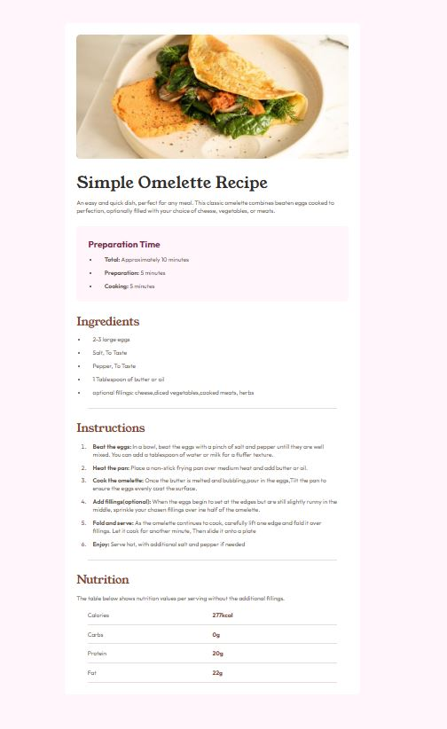

# Frontend Mentor - Recipe page solution

This is a solution to the [Recipe page challenge on Frontend Mentor](https://www.frontendmentor.io/challenges/recipe-page-KiTsR8QQKm). Frontend Mentor challenges help you improve your coding skills by building realistic projects.

### Screenshot

### Links

- Solution URL: [Github](https://github.com/MariamReda25/Frontend-Mentor-/tree/main/Recipe-page)
- Live Site URL: [Netlify](https://recipe-page-challenge4.netlify.app/)

## Author

- Frontend Mentor - [MariamReda25](https://www.frontendmentor.io/profile/MariamReda25)
