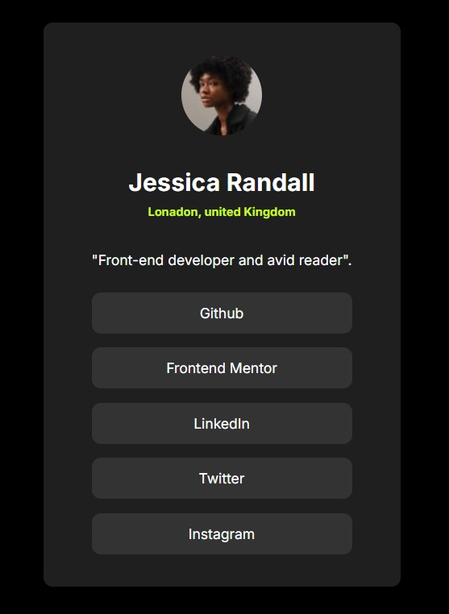

# Frontend Mentor - Social links profile solution

This is a solution to the [Social links profile challenge on Frontend Mentor](https://www.frontendmentor.io/challenges/social-links-profile-UG32l9m6dQ). Frontend Mentor challenges help you improve your coding skills by building realistic projects.

### The challenge

Users should be able to:

- See hover and focus states for all interactive elements on the page

### Screenshot

### Links

- Solution URL: [Github](https://github.com/MariamReda25/Frontend-Mentor-/tree/main/Social-links-profile)
- Live Site URL: [Netlify](https://social-links-profile-challenge3.netlify.app/)

## Author

- Frontend Mentor - [MariamReda25](https://www.frontendmentor.io/profile/MariamReda25)
