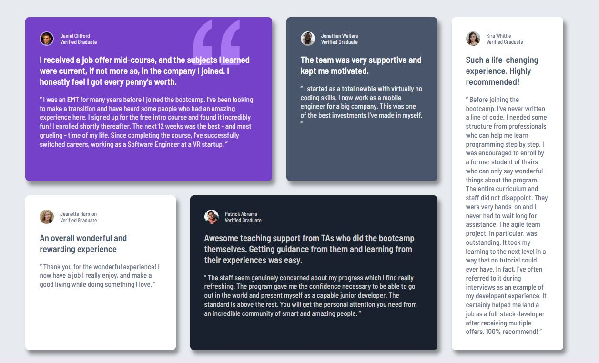

# Frontend Mentor - Testimonials grid section solution

This is a solution to the [Testimonials grid section challenge on Frontend Mentor](https://www.frontendmentor.io/challenges/testimonials-grid-section-Nnw6J7Un7). Frontend Mentor challenges help you improve your coding skills by building realistic projects.

### The challenge

Users should be able to:

- View the optimal layout depending on their device's screen size

### Screenshot

### Links

- Solution URL: [Github](https://github.com/MariamReda25/Frontend-Mentor-/tree/main/Testimonials-grid)
- Live Site URL: [Netlify](https://testimonial-grid-challenge-sol.netlify.app/)

## Author

- Frontend Mentor - [MariamReda25](https://www.frontendmentor.io/profile/MariamReda25)
